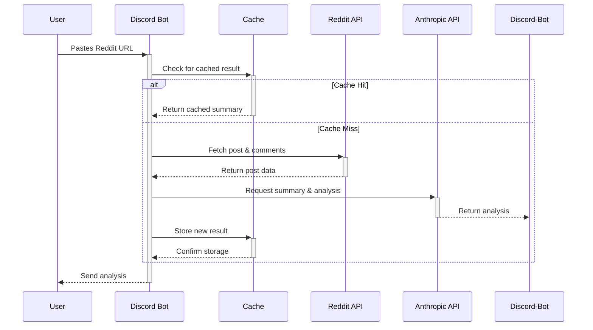

# Reddit Post Analyzer Bot

A Discord bot that provides AI-powered summaries and analysis of Reddit posts. Paste any Reddit post URL and get a quick, digestible summary of the post content and comments, complete with sentiment analysis and mood tracking.

## Features

- **Post Summarization**: Get a concise TL;DR of any Reddit post.
- **Comment Analysis**: Summarizes the top comments to capture the crowd's opinion.
- **Sentiment Analysis**: Breaks down comment sentiment into positive, negative, and neutral percentages.
- **Emotion Detection**: Identifies the top emotions expressed in the comments (e.g., happy, angry, curious).
- **Intensity Meter**: A visual gauge of the comment section's overall intensity.
- **AI Model Selection**: Switch between different Anthropic Claude models (`Claude 3 Haiku`, `Claude 3.5 Haiku`, `Claude Sonnet 4`) to balance speed and quality.
- **Caching**: Results are cached to provide instant responses for previously analyzed posts.
- **Usage Tracking**: Per-user rate limiting and daily quotas to manage API usage.

## How to Use

Simply paste a Reddit post URL into any channel where the bot is present. The bot will automatically fetch the data, analyze it, and post a summary.

## Architecture

The diagram below illustrates the bot's request lifecycle from the moment a user provides a Reddit URL until the analysis is returned.



### Commands

The bot uses Discord slash commands for configuration and other actions:

-   `/start`: Displays a welcome message.
-   `/help`: Shows a list of all available commands.
-   `/model`: Allows you to switch the AI model used for analysis.
    -   `model`: `haiku3` (fastest), `haiku35` (balanced), `sonnet4` (highest quality).
-   `/usage`: Checks your current daily API usage.
-   `/whoami`: Displays your Discord user ID.
-   `/cache`: Shows statistics about the analysis cache.
-   `/clearcache`: Clears the cache manually.

## Setup and Installation

You can run the bot locally using Python or deploy it as a Docker container.

### Prerequisites

-   Python 3.11+
-   Git
-   An account with [Discord](https://discord.com/developers/applications), [Reddit](https://www.reddit.com/prefs/apps), and [Anthropic](https://console.anthropic.com/) to get API credentials.

### Local Setup

1.  **Clone the repository:**
    ```bash
    git clone https://github.com/shuienko/rpostsummarybot.git
    cd rpostsummarybot
    ```

2.  **Set up a virtual environment:**
    ```bash
    python3 -m venv venv
    source venv/bin/activate
    # On Windows, use: venv\Scripts\activate
    ```

3.  **Install dependencies:**
    ```bash
    pip install -r requirements.txt
    ```

4.  **Configure environment variables:**
    Create a file named `.env` in the root of the project and add the following variables:
    ```env
    # Required API Keys
    DISCORD_TOKEN="your_discord_bot_token"
    REDDIT_CLIENT_ID="your_reddit_client_id"
    REDDIT_CLIENT_SECRET="your_reddit_client_secret"
    ANTHROPIC_API_KEY="your_anthropic_api_key"
    
    # Optional Configuration (with defaults)
    MAX_REQUESTS_PER_DAY=30
    RATE_LIMIT_SECONDS=30
    DEFAULT_AI_MODEL=haiku3
    CACHE_MAX_SIZE=100
    CACHE_TTL_HOURS=24
    MAX_TOKENS_PER_REQUEST=1024
    MAX_COMMENTS_TO_ANALYZE=10
    MAX_EMOTIONS_TO_SHOW=3
    DISCORD_MESSAGE_MAX_LENGTH=2000
    ```

5.  **Run the bot:**
    ```bash
    python bot.py
    ```

**Note:** You can copy `env.example` to `.env` and modify the values as needed:
```bash
cp env.example .env
# Edit .env with your actual API keys and preferred settings
```

### Docker Deployment

The included `Dockerfile` allows you to run the bot in a container.

1.  **Clone the repository:**
    ```bash
    git clone https://github.com/shuienko/rpostsummarybot.git
    cd rpostsummarybot
    ```

2.  **Configure environment variables:**
    Create a directory named `config` and place your `.env` file inside it.
    ```bash
    mkdir config
    # Copy the example file and edit with your settings
    cp env.example config/.env
    nano config/.env
    ```

3.  **Build the Docker image:**
    ```bash
    docker build -t rpostsummarybot .
    ```

4.  **Run the Docker container:**
    This command mounts the `config` directory into the container.
    ```bash
    docker run -d --name rpostsummarybot -v "$(pwd)/config":/app/config rpostsummarybot
    ```

## Environment Variables

The bot uses the following environment variables for configuration:

### Required Variables
-   `DISCORD_TOKEN`: The token for your Discord bot.
-   `REDDIT_CLIENT_ID`: The client ID from your Reddit script application.
-   `REDDIT_CLIENT_SECRET`: The client secret from your Reddit script application.
-   `ANTHROPIC_API_KEY`: Your API key for the Anthropic (Claude) API.

### Optional Configuration Variables
All optional variables have sensible defaults and can be omitted:

#### Rate Limiting & Usage
-   `MAX_REQUESTS_PER_DAY`: Maximum requests per user per day (default: 30)
-   `RATE_LIMIT_SECONDS`: Seconds between requests for rate limiting (default: 30)
-   `DEFAULT_AI_MODEL`: Default AI model to use (default: haiku3)

#### Cache Settings
-   `CACHE_MAX_SIZE`: Maximum number of cached results (default: 100)
-   `CACHE_TTL_HOURS`: Hours before cached results expire (default: 24)

#### AI Analysis Settings
-   `MAX_TOKENS_PER_REQUEST`: Maximum tokens per AI request (default: 1024)
-   `MAX_COMMENTS_TO_ANALYZE`: Number of top comments to analyze (default: 10)
-   `MAX_EMOTIONS_TO_SHOW`: Number of top emotions to display (default: 3)
-   `SENTIMENT_INTENSITY_MIN`: Minimum intensity value (default: 1)
-   `SENTIMENT_INTENSITY_MAX`: Maximum intensity value (default: 5)
-   `DEFAULT_INTENSITY_VALUE`: Default intensity when analysis fails (default: 3)

#### Discord Message Settings
-   `DISCORD_MESSAGE_MAX_LENGTH`: Maximum length for Discord messages (default: 2000)
-   `DISCORD_TITLE_MAX_LENGTH`: Maximum length for title truncation (default: 50)

#### Summary Settings
-   `POST_SUMMARY_MAX_SENTENCES`: Maximum sentences in post summary (default: 4)
-   `COMMENT_SUMMARY_MAX_SENTENCES`: Maximum sentences in comment summary (default: 4)

#### Logging Settings
-   `LOG_MAX_BYTES`: Maximum log file size in bytes (default: 5242880)
-   `LOG_BACKUP_COUNT`: Number of log backup files (default: 5)
-   `LOG_TRUNCATE_LENGTH`: Maximum length for log message truncation (default: 50)

#### Reddit Settings
-   `REDDIT_USER_AGENT`: User agent string for Reddit API (default: python:rpostsummarybot:v1.0)

## License

This project is licensed under the terms of the license specified in the `LICENSE` file. 